<h2>Use Case JPA Hibernate Spring Data Many To Many Case
</h2>
<h6>1) L'entité JPA User </h6>
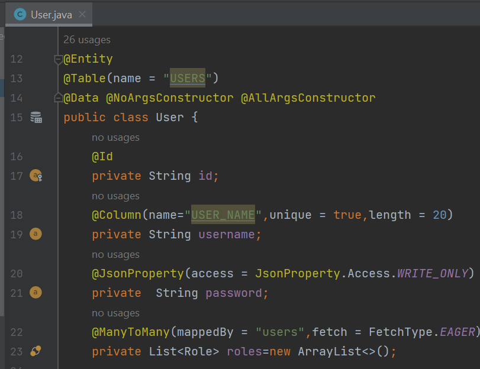
<h6>2) L'entité JPA Role </h6>
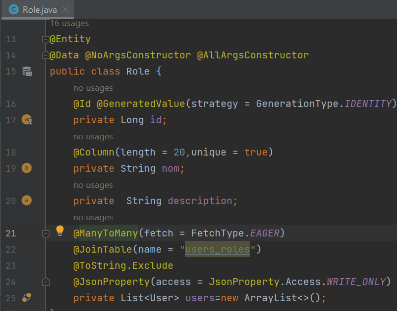
<h6>3) Les interfaces Jpa </h6>
<li>RoleRepository</li>
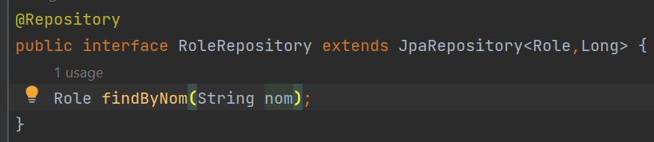
<li>UserRepository</li>
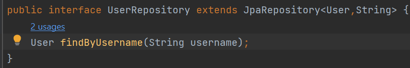
<h6>L'interface UserService</h6>
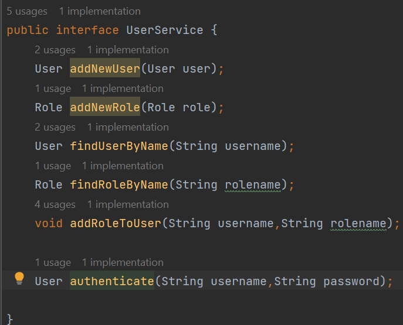
<h6>L'implémentation de l'interface UserService</h6>
<li>L'ajout d'un utilisateur et un role </li>
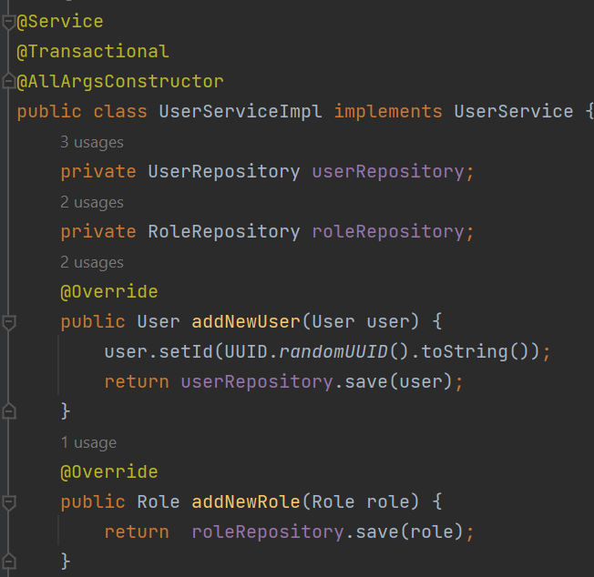
<li>Chercher un utilisateur et un role</li>
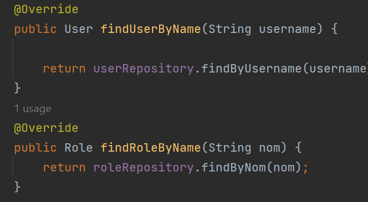
<li>Ajouter un role a un utilisateur</li>
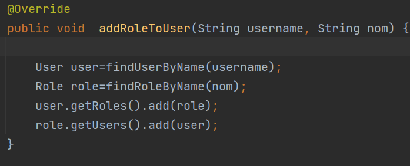
<h6>L'application Jpa</h6>
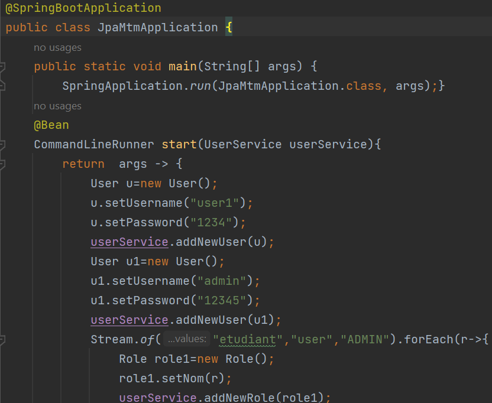

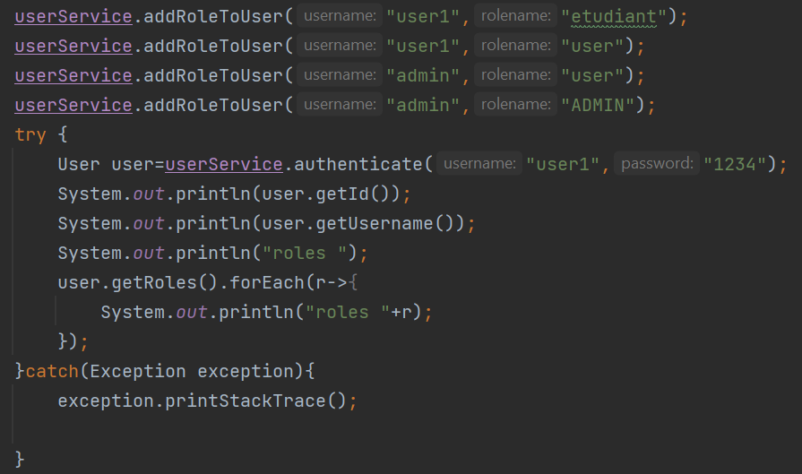
<h6>L'arborescence du projet</h6>
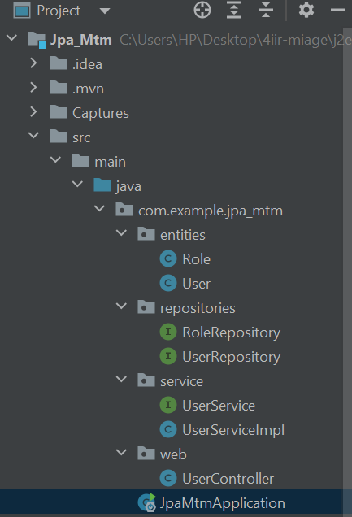

