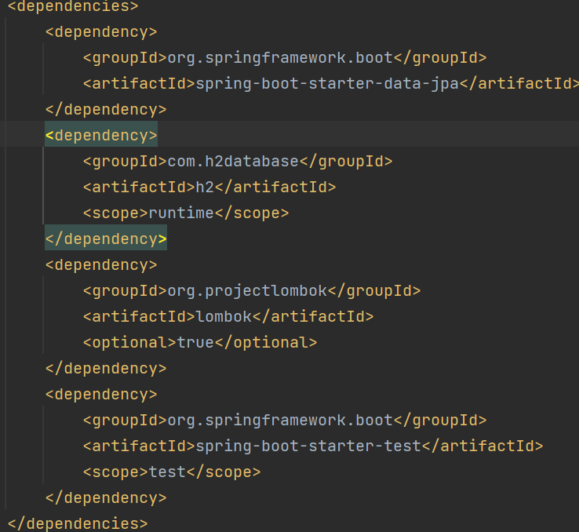
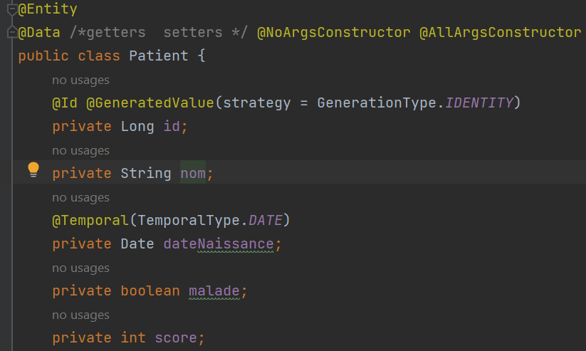
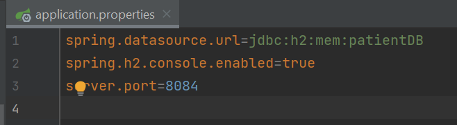
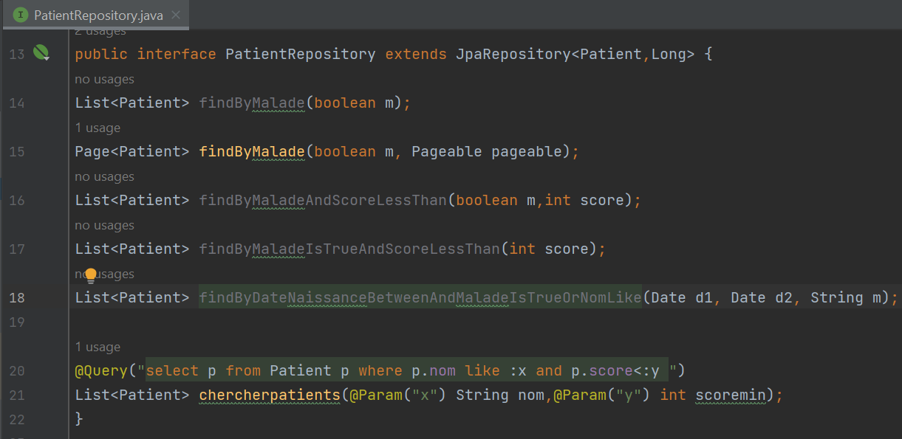
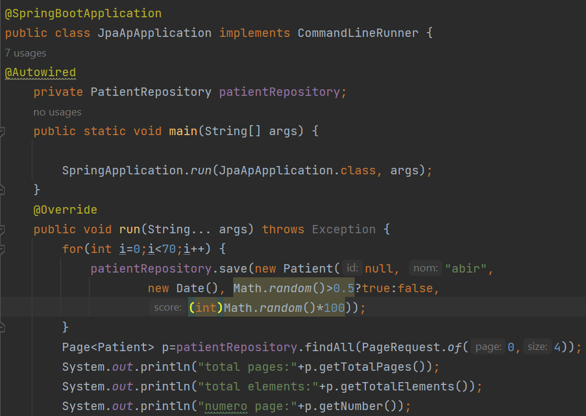
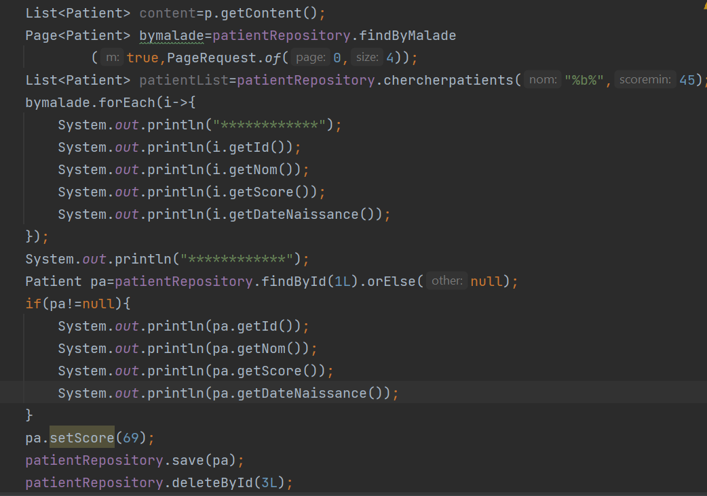
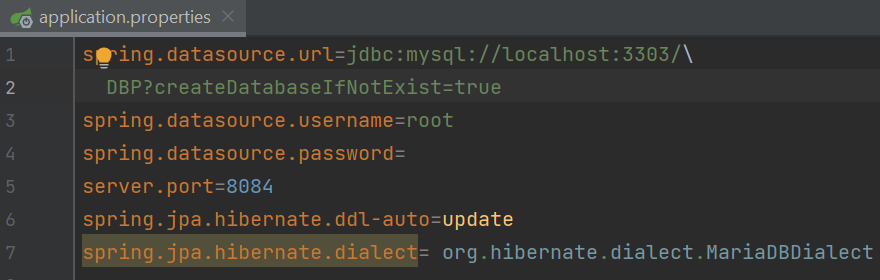
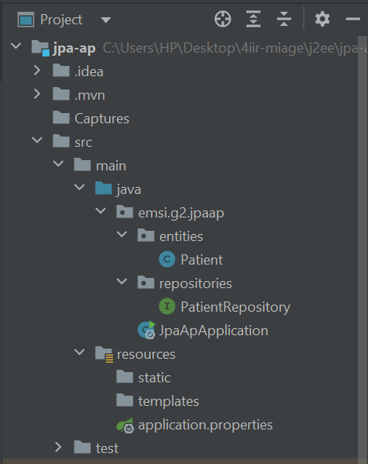

<h2> ORM avec Spring Data, JPA Hibernate</h2>
<h6>1) Les dépendances JPA, H2, Spring Web et Lombock (pom.xml)</h6>

<h6>2) L'entité JPA Patient</h6>

<h6>3) Le ficher application.properties</h6>

<h6>4) L'interface JPA Repository basée sur Spring data</h6>

<h6>5) L'application Jpa pour gérer les patients</h6>
<li>L'opération d'ajout et de consultation des patients</li>

<li>La mise à jour et la suppression d'un patient</li>

<h6>6) Migrer de H2 Database vers MySQL</h6>

<h6>L'arborescence du projet</h6>

